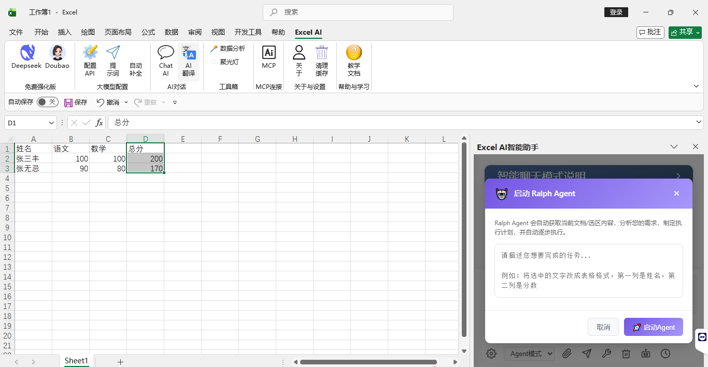
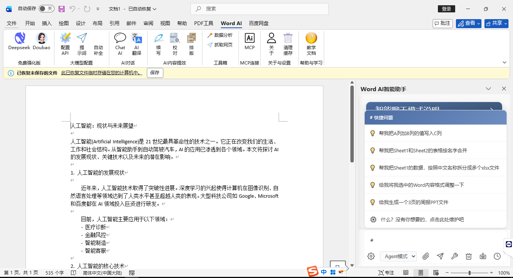

# Office AI Assistant

<div align="center">

[](LICENSE)
[](https://www.microsoft.com/windows)
[](https://www.microsoft.com/office)

**Language / 语言选择**

[English](README_EN.md) | [中文](README.md)

</div>

## Screenshots






## Overview

Office AI Assistant is a Windows Office add-in suite built with Visual Studio 2022, Visual Basic.NET, .NET Framework 4.7.2, and VSTO. It provides AI-assisted workflows for Excel, Word, and PowerPoint.

## Features

- AI data analysis, formula assistance, and chart generation
- Word document processing, continuation, review, formatting, and translation
- PowerPoint content generation, review, formatting, and translation
- WebView2 chat interface backed by HTML/CSS/JS
- MCP Client integration with configurable MCP Server connections
- Multiple configurable model providers

## Supported Products

| Product | Status | Features |
|---------|--------|----------|
| Microsoft Excel | Supported | Data analysis, chart generation, formula assistance, ALLM/CLLM functions |
| Microsoft Word | Supported | Document processing, content generation, review, continuation, formatting, translation |
| Microsoft PowerPoint | Supported | Presentation creation, slide processing, review, continuation, formatting, translation |
| WPS Office for Windows | Compatible | Loaded through Windows add-in registration |

## Build

### Requirements

- Windows 10 or Windows 11
- Microsoft Office 2016+ or WPS Office for Windows
- Visual Studio 2022
- Office/SharePoint development workload
- .NET Framework 4.7.2 Developer Pack
- Microsoft Visual Studio Installer Projects extension

### Build from Source

```bash
git clone https://github.com/JGoP-L/officeAI.git
```

Open `AiHelper.sln` with Visual Studio 2022 on Windows, restore NuGet packages, and build the solution. The installer project is under `OfficeAgent/`.

## Project Structure

```text
officeAI/
├── ExcelAi/          # Excel add-in
├── WordAi/           # Word add-in
├── PowerPointAi/     # PowerPoint add-in
├── ShareRibbon/      # Shared components, UI, config, AI communication, MCP
└── OfficeAgent/      # Windows installer project
```

## Usage

1. Install the add-ins and start Excel, Word, or PowerPoint.
2. Open the AI Assistant from the ribbon.
3. Configure model API settings.
4. Select document content, cells, or slides, then ask questions or run tasks.

## License

This project is licensed under Apache 2.0. See [LICENSE](LICENSE) for details.
